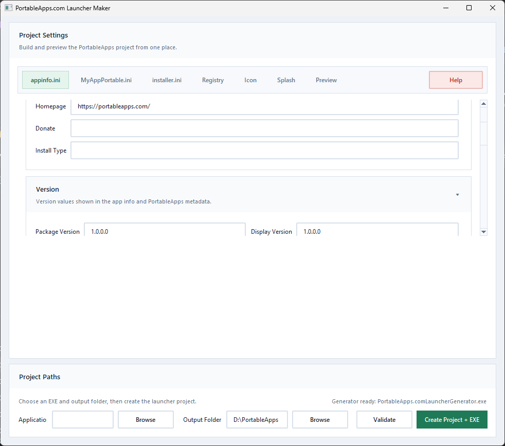

# PortableApps Launcher Maker

PortableApps Launcher Maker is a Windows Tkinter desktop app for building **PortableApps.com-style project folders** from a normal application EXE.

It helps generate the pieces needed for a portable app package, including:
- `appinfo.ini`
- `launcher.ini`
- optional `installer.ini`
- PortableApps icon sizes
- `help.html` and help assets
- splash assets
- preview output before build

It can also call the **PortableApps.com Launcher Generator** to build the final portable launcher EXE when that tool is available.

## Quick Start

1. Launch the app
2. Choose your application EXE
3. Leave the output folder pointed at `X:\PortableApps` or choose another location
4. Fill in the `appinfo.ini`, launcher, installer, registry, icon, and splash settings you need
5. Click `Validate`
6. Click `Create Project + EXE`

If the PortableApps.com Launcher Generator is not installed, the app will offer to open:
- [PortableApps.com Development](https://portableapps.com/development)

## Screenshot



## Features

- creates the standard `App`, `Data`, and `Other` structure
- copies the selected application's folder
- extracts embedded icons from the selected EXE
- generates PortableApps icon outputs:
  - `appicon.ico`
  - `appicon_16.png`
  - `appicon_32.png`
  - `appicon_75.png`
  - `appicon_128.png`
  - `appicon_256.png`
- supports registry, icon, splash, and installer settings
- imports saved `.reg` exports into `RegistryKeys`
- previews generated folder layout and INI output live
- shows icon preview sizes from largest to smallest
- validates project settings before build
- uses collapsible card sections and a more web-style settings UI
- supports both 64-bit and 32-bit packaged app builds
- creates GitHub-release ZIP assets from finished builds

## Current UI

The app is organized into focused tabs:
- `appinfo.ini`
- `AppNamePortable.ini`
- `installer.ini`
- `Registry`
- `Icon`
- `Splash`
- `Preview`

Notable UI behavior:
- collapsible cards for major sections
- fixed top tab navigation while forms scroll
- styled folder preview with important generated files highlighted
- icon preview strip showing multiple generated sizes
- help popup for PAL variables and registry guidance

## Build Workflow

Typical workflow:
1. Choose the application EXE and output folder
2. Fill in `appinfo.ini`, launcher, installer, registry, icon, and splash settings
3. Run `Validate`
4. Run `Create Project + EXE`
5. The tool generates the PortableApps project and, when available, calls the PortableApps.com Launcher Generator

## Running From Source

```powershell
python -m app.portableapps_main
```

Or install in editable mode:

```powershell
pip install -e .
portableapps-launcher-maker
```

## Release Builds

The packaged releases use **PyInstaller one-folder builds**. Keep the whole output folder together; do not copy only the `.exe`.

### 64-bit

Requires a **64-bit Python** with PyInstaller available in that interpreter.

```powershell
powershell -ExecutionPolicy Bypass -File .\build_portableapps_release.ps1 -Python64 "C:\Path\To\Python64\python.exe"
```

Output:
- `dist\PortableAppsLauncherMaker\PortableAppsLauncherMaker.exe`

### 32-bit / x86

Requires:
- a **32-bit Python**
- `PyInstaller` installed into that 32-bit Python

```powershell
powershell -ExecutionPolicy Bypass -File .\build_portableapps_release_x86.ps1 -Python32 "C:\Path\To\Python32\python.exe"
```

You can also set `PORTABLEAPPS_X86_PYTHON` first and run the script without arguments.

Output:
- `dist\PortableAppsLauncherMaker-x86\PortableAppsLauncherMaker-x86.exe`

### GitHub Release ZIPs

After you have built one or both architectures, create GitHub-friendly ZIP assets with:

```powershell
powershell -ExecutionPolicy Bypass -File .\package_github_release.ps1
```

Output:
- `dist\release\PortableAppsLauncherMaker-win64.zip`
- `dist\release\PortableAppsLauncherMaker-win32.zip`

You can use `-Skip64` or `-Skip32` if you only built one architecture.

## Downloads

For GitHub, the best distribution path is:
- commit **source code** to the repo
- upload packaged builds to **GitHub Releases**

Recommended release assets:
- `PortableAppsLauncherMaker-win64.zip`
- `PortableAppsLauncherMaker-win32.zip`

## Repository Layout

- `app/`: application source
- `tests/`: automated tests
- `build_portableapps_release.ps1`: 64-bit release build
- `build_portableapps_release_x86.ps1`: 32-bit release build
- `package_github_release.ps1`: creates GitHub release ZIPs from built folders

## Notes

- `build/` and `dist/` are generated output and should not normally be committed
- generated PyInstaller `.spec` files are intentionally ignored
- building the final portable launcher EXE expects the **PortableApps.com Launcher Generator** to be installed and available
- bundled default branding assets live in `app/assets/`
